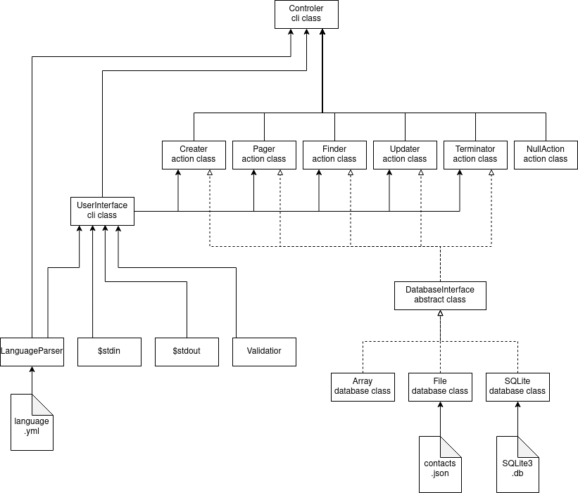

[](https://travis-ci.org/Matt-Warnock/contact-book)
[](https://coveralls.io/github/Matt-Warnock/contact-book?branch=master)
[](https://codeclimate.com/github/Matt-Warnock/contact-book/maintainability)
[](https://depfu.com/github/Matt-Warnock/contact-book?project=Bundler)


# Readme

Contact Book is a file system for storing personal contact details.

## System Diagram



## Badges

* Turn your repo ON in Travis (CI), in Coveralls (coverage status), codeclimate (maintainability), and depfu (dependency status).
* Update badges with your user/repo names.


## How to use this project

This is a Ruby project. Tell your Ruby version manager to set your local Ruby version to the one specified in the `Gemfile`.

For example, if you are using [rbenv](https://cbednarski.com/articles/installing-ruby/):

1. Install the right Ruby version:
  ```bash
  rbenv install < VERSION >
  ```
1. Move to the root directory of this project and type:
  ```bash
  rbenv local < VERSION >
  ruby -v
  ```

You will also need to install the `bundler` gem, which will allow you to install the rest of the dependencies listed in the `Gemfile` file of this project.

```bash
gem install bundler
rbenv rehash
```


### Folder structure

* `bin `: Executable files
* `lib `: Source files
* `spec`: Test files


### To initialise the project

```bash
bundle install
```


### To run the app

Make sure that the `bin/app` file has execution permissions:

```bash
chmod +x bin/app
```

Then just type:

```bash
bin/app
```

If this doesn't work you can always do:

```bash
bundle exec ruby bin/app
```

## Tests


### To run all tests


```bash
bundle exec rspec
```


### To run a specific file


```bash
bundle exec rspec path/to/test/file.rb
```


### To run a specific test

```bash
bundle exec rspec path/to/test/file.rb:TESTLINENUMBER
```


### To run rubocop

```bash
bundle exec rubocop
```


### To run all tests and rubocop

```bash
bundle exec rake
```


## License

[](https://opensource.org/licenses/mit)
MIT License
